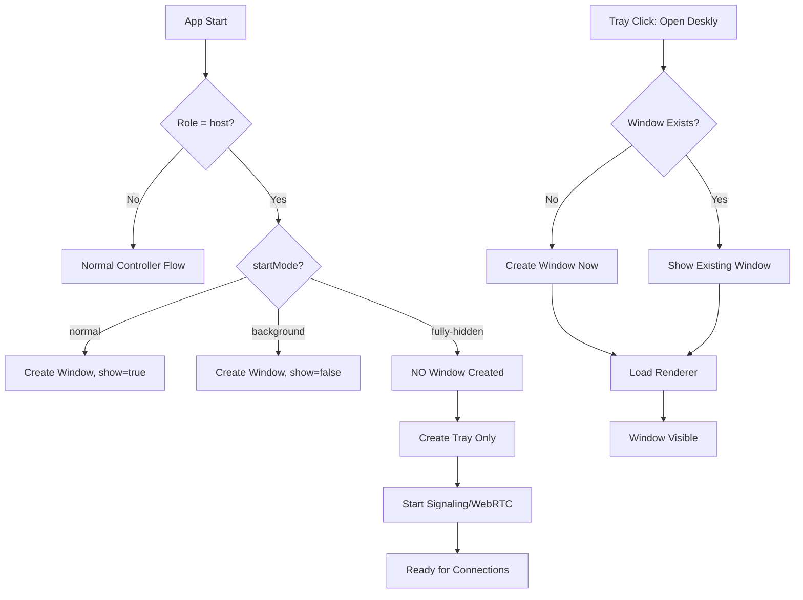

# Fully Hidden Host Mode - Implementation Plan

## Overview

Add a new "Fully Hidden" host mode that runs the Host as a completely background process with **no visible window at all** (not even on first launch), while keeping the existing system tray functionality intact. The current "background" mode still creates a hidden BrowserWindow that can be shown via tray; the new mode should avoid creating any BrowserWindow unless explicitly requested via tray.

## Current State Analysis

### Existing "Background" Mode (`hostRunInBackground` setting)
- Creates a `BrowserWindow` but with `show: false` (line 126 in main.js)
- Window is hidden but still exists in memory
- Tray menu has "Open Deskly" → shows the hidden window
- User can toggle via Settings checkbox "Auto-hide Host to System Tray on startup"
- Started via `start-host-hidden.vbs` which runs `npm run host` (still creates window)

### New "Fully Hidden" Mode Requirements
- **No BrowserWindow created at all** unless user clicks "Open Deskly" from tray
- No renderer process spawned until needed
- Lower memory footprint
- True background service-like behavior
- Still accessible via system tray for configuration/status

## Architecture Design

### Mode States
```
┌─────────────────────────────────────────────────────────────┐
│                    HOST MODE STATES                         │
├─────────────────────────────────────────────────────────────┤
│                                                             │
│  ┌──────────────┐     ┌──────────────┐     ┌────────────┐  │
│  │   Normal     │     │  Background  │     │ Fully      │  │
│  │   (Window    │     │  (Hidden     │     │  Hidden    │  │
│  │   Visible)   │     │   Window)    │     │  (No Win)  │  │
│  └──────┬───────┘     └──────┬───────┘     └─────┬──────┘  │
│         │                    │                   │          │
│         ▼                    ▼                   ▼          │
│  BrowserWindow          BrowserWindow         No Window    │
│  created at             created at            created only │
│  startup                startup               on demand    │
│                                                             │
└─────────────────────────────────────────────────────────────┘
```

### Startup Flow


## Implementation Plan

### 1. main.js Changes

#### New Command Line Argument
```javascript
// Add after line 8 (apiArg)
const startModeArg = process.argv.find((a) => a.startsWith("--start-mode="));
const startMode = startModeArg ? startModeArg.split("=")[1] : ""; // "normal" | "background" | "fully-hidden"
```

#### Modified `createWindow()` - Conditional Creation
```javascript
function createWindow() {
  // Skip window creation entirely for fully-hidden mode
  if (startRole === "host" && startMode === "fully-hidden") {
    writeLog("info", "Main", "Fully hidden mode: skipping BrowserWindow creation");
    return; // No window created
  }
  
  // ... existing window creation code ...
  // Modify line 126: show: startRole !== "host" || startMode === "normal"
}
```

#### Modified `createTray()` - Dynamic Menu
```javascript
function createTray() {
  tray = new Tray(trayImage());
  const isFullyHidden = startRole === "host" && startMode === "fully-hidden";
  
  const menuTemplate = [
    { 
      label: isFullyHidden ? "Open Deskly (Create Window)" : "Open Deskly", 
      click: showWindow 
    },
    // ... rest of menu
  ];
  
  if (isFullyHidden) {
    // Add status indicator
    menuTemplate.unshift({
      label: "● Deskly Host — Fully Hidden (Running)",
      enabled: false
    }, { type: "separator" });
  }
  
  tray.setContextMenu(Menu.buildFromTemplate(menuTemplate));
}
```

#### Modified `showWindow()` - Lazy Window Creation
```javascript
function showWindow() {
  if (!mainWindow) {
    // Lazy create window when user requests it
    if (startRole === "host" && startMode === "fully-hidden") {
      writeLog("info", "Main", "Creating BrowserWindow on demand from tray");
      createWindow(); // This will now create the window
      // Need to re-load the renderer since createWindow() loads the file
    }
  }
  if (mainWindow) {
    mainWindow.show();
    mainWindow.focus();
  }
}
```

#### New IPC Handler for Mode Info
```javascript
ipcMain.handle("deskly:start-mode", () => startMode || "normal");
ipcMain.handle("deskly:is-fully-hidden", () => startRole === "host" && startMode === "fully-hidden");
```

### 2. preload.js Changes

Add new exposed APIs:
```javascript
contextBridge.exposeInMainWorld("deskly", {
  // ... existing ...
  getStartMode: () => ipcRenderer.invoke("deskly:start-mode"),
  isFullyHidden: () => ipcRenderer.invoke("deskly:is-fully-hidden"),
});
```

### 3. Renderer Changes (app.js)

#### Bootstrap Logic Update
```javascript
async function bootstrap() {
  const startRole = await window.deskly.getStartRole();
  const startMode = await window.deskly.getStartMode();
  const isFullyHidden = await window.deskly.isFullyHidden();
  
  state.role = startRole || state.role || "host";
  state.startMode = startMode;
  
  if (!state.token) {
    // In fully-hidden mode, we should NOT show window for login
    // Instead, show a notification or wait for tray interaction
    if (isFullyHidden) {
      // Show tray notification: "Deskly needs setup - click tray to configure"
      // For now, fall back to creating window for setup
      await window.deskly.showWindow();
    } else {
      show("view-login");
      await window.deskly.showWindow();
    }
    return;
  }
  // ... rest of bootstrap
}
```

#### Settings UI Update
Add new radio button group for host startup mode:
```html
<!-- In index.html, host-info section -->
<fieldset style="margin-top: 12px; padding: 12px; border: 1px solid var(--line); border-radius: 8px;">
  <legend style="color: var(--accent); font-size: 12px; font-weight: 600;">Host Startup Mode</legend>
  <label class="radio"><input type="radio" name="start-mode" value="normal" id="mode-normal" /> Normal (Window Visible)</label>
  <label class="radio"><input type="radio" name="start-mode" value="background" id="mode-background" /> Background (Hidden Window)</label>
  <label class="radio"><input type="radio" name="start-mode" value="fully-hidden" id="mode-fully-hidden" /> Fully Hidden (No Window)</label>
</fieldset>
```

```css
/* In style.css */
.radio { display: block; margin: 6px 0; cursor: pointer; color: var(--text); }
.radio input { margin-right: 8px; accent-color: var(--accent); }
```

#### Save Settings with New Mode
```javascript
async function saveSettings() {
  const newStartMode = document.querySelector('input[name="start-mode"]:checked')?.value || "normal";
  
  state.settings = {
    // ... existing ...
    hostRunInBackground: newStartMode === "background" || newStartMode === "fully-hidden",
    hostStartMode: newStartMode, // New field
  };
  
  // If mode changed to/from fully-hidden, need app restart
  if (newStartMode !== state.startMode) {
    setSessionFeedback("Startup mode changed — restart Deskly to apply");
    // Could also trigger auto-restart via main process
  }
  
  // ... rest of save
}
```

### 4. Start Scripts

#### New `start-host-fully-hidden.bat`
```bat
@echo off
cd /d "%~dp0desktop"
start "" wscript.exe "%~dp0start-host-fully-hidden.vbs"
exit /b
```

#### New `start-host-fully-hidden.vbs`
```vbscript
Option Explicit

' Starts the Host in FULLY HIDDEN mode - no window ever created unless user opens from tray
Dim shell, fileSystem, projectFolder
Set shell = CreateObject("WScript.Shell")
Set fileSystem = CreateObject("Scripting.FileSystemObject")
projectFolder = fileSystem.GetParentFolderName(WScript.ScriptFullName)

shell.CurrentDirectory = projectFolder & "\desktop"
' Pass --start-mode=fully-hidden to prevent any window creation
shell.Run "cmd.exe /c npm run host -- --start-mode=fully-hidden", 0, False
```

#### Update `desktop/package.json` Scripts
```json
"scripts": {
  "start": "electron .",
  "host": "electron . --role=host",
  "host:background": "electron . --role=host --start-mode=background",
  "host:fully-hidden": "electron . --role=host --start-mode=fully-hidden",
  "controller": "electron . --role=controller",
  "dist": "electron-builder --win nsis"
}
```

### 5. Settings/Storage

#### New Settings Field
Add to `Settings` model (api/src/models.js):
```javascript
hostStartMode: { 
  type: String, 
  enum: ["normal", "background", "fully-hidden"], 
  default: "normal" 
},
```

#### Migration for Existing Users
In routes.js settings PATCH handler, map old `hostRunInBackground` to new `hostStartMode`:
```javascript
if (typeof patch.hostRunInBackground === "boolean") {
  allowed.hostRunInBackground = patch.hostRunInBackground;
  // Backward compatibility
  if (patch.hostRunInBackground && !patch.hostStartMode) {
    allowed.hostStartMode = "background";
  } else if (!patch.hostRunInBackground && !patch.hostStartMode) {
    allowed.hostStartMode = "normal";
  }
}
if (["normal", "background", "fully-hidden"].includes(patch.hostStartMode)) {
  allowed.hostStartMode = patch.hostStartMode;
  // Sync legacy field
  allowed.hostRunInBackground = patch.hostStartMode !== "normal";
}
```

### 6. Tray Tooltip Update
```javascript
function createTray() {
  let tooltip = "Deskly";
  if (startRole === "host") {
    if (startMode === "fully-hidden") {
      tooltip = "Deskly Host — Fully Hidden (Running)";
    } else {
      tooltip = "Deskly Host — Running in Background";
    }
  }
  tray.setToolTip(tooltip);
  // ...
}
```

## File Changes Summary

| File | Changes |
|------|---------|
| `desktop/main.js` | Add `--start-mode` arg, conditional window creation, lazy window creation in `showWindow()`, dynamic tray menu, new IPC handlers |
| `desktop/preload.js` | Expose `getStartMode()`, `isFullyHidden()` |
| `desktop/renderer/index.html` | Add radio button group for startup mode selection |
| `desktop/renderer/style.css` | Add `.radio` styles |
| `desktop/renderer/app.js` | Read start mode in bootstrap, handle fully-hidden login flow, save new `hostStartMode` setting |
| `api/src/models.js` | Add `hostStartMode` field to Settings schema |
| `api/src/routes.js` | Handle `hostStartMode` in settings PATCH, backward compatibility with `hostRunInBackground` |
| `start-host-fully-hidden.bat` | New file |
| `start-host-fully-hidden.vbs` | New file |
| `desktop/package.json` | Add `host:fully-hidden` script |

## Edge Cases & Considerations

1. **First-time Setup in Fully Hidden Mode**: User installs, chooses "Fully Hidden", but needs to create account. Solution: On first run with no token, auto-create window for setup, then switch to fully-hidden after login.

2. **WebRTC Screen Capture**: `desktopCapturer.getSources()` requires a BrowserWindow context. In fully-hidden mode, screen capture still works because the handler is registered on `session.defaultSession` (not tied to a specific window).

3. **Global Shortcuts**: `CommandOrControl+Alt+Q/E` still work because they're registered at app level, not window level.

4. **Auto-start on Windows**: The fully-hidden mode is ideal for Windows startup (registry Run key) - no flashing window.

5. **Memory**: Fully hidden mode saves ~50-100MB RAM by not creating renderer process until needed.

6. **Updates**: When user changes mode via settings, show "Restart required" notification.

## Testing Checklist

- [ ] Normal mode: Window visible on startup
- [ ] Background mode: Window hidden on startup, tray shows "Open Deskly" → shows window
- [ ] Fully-hidden mode: No window process in Task Manager on startup, tray shows "Open Deskly (Create Window)" → creates and shows window
- [ ] Switching modes via settings requires restart notification
- [ ] Screen sharing works in all three modes
- [ ] Input injection works in all three modes
- [ ] Tray tooltip reflects correct mode
- [ ] Global shortcuts work in fully-hidden mode
- [ ] Logging works in fully-hidden mode
- [ ] First-run setup flows correctly for each mode

## Rollout Strategy

1. Implement behind feature flag initially
2. Test internally with fully-hidden as default for host installs
3. Add to installer: "How should Host start?" radio group (Normal / Background / Fully Hidden)
4. Document in README